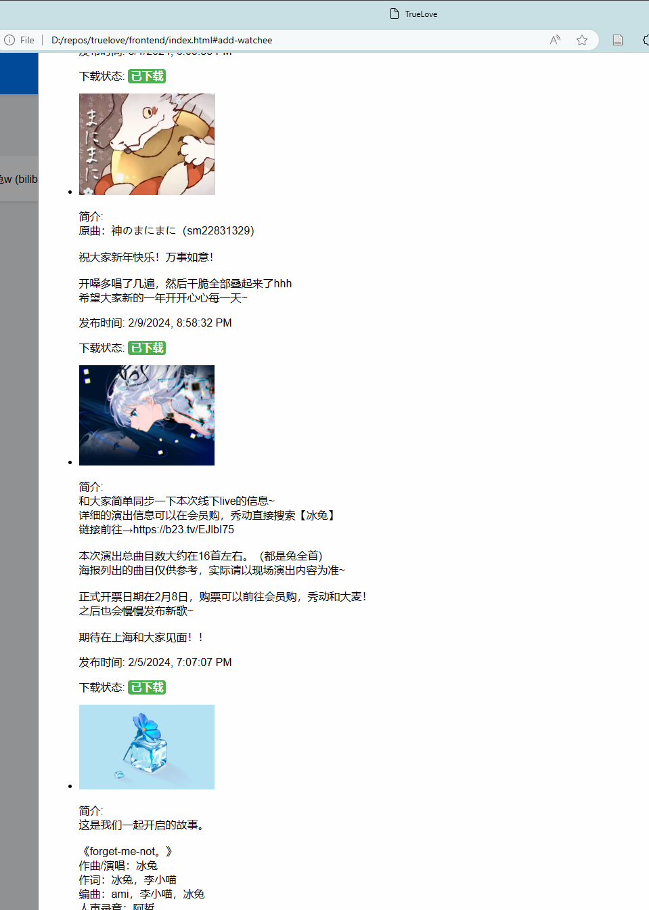

# Truelove
- [Truelove](#truelove)
  - [目前支持](#目前支持)
  - [后续可能的更新计划](#后续可能的更新计划)
  - [使用方法](#使用方法)
    - [自定义扩展](#自定义扩展)

还在因为错过喜欢的作者的动态和投稿而烦恼吗？还在因为一个个单独下载保存太麻烦吗？那这个项目就是为你准备的！

偶尔喜欢的作者会删投稿, 但我是个"变态", 一个都不想错过x, 即使使用 `zotero` 或者其他网页插件也感觉很麻烦, 
又懒得每次更新都自己去下载, 于是就有了这个项目<br>
整体可能和 `rss` 类似, 但 `rss` 主要目的应该是获取推送, 本项目则多一个保存功能

后续目标是从各个平台扒作者的作品, 离线保存到本地<br>
目前仅支持b站视频, 其他平台例如 youtube, patreon 等虽然有计划, 但最近应该不会更

前端不想写, vue都懒得套, 于是回归远古 `html+css+js(jquery)` 一把梭, 久违的试一下还挺爽


## 目前支持
- [x] b站视频
- [ ] b站动态

## 后续可能的更新计划
- 自定义保存规则, 正则关键词等
- youtube
- 多支持几个core用
- 离线保存网页
- 优化一下前端? 应该没可能x, 写界面是不可能写界面的, 这辈子都不可能写界面的

## 使用方法
- python3.12+, 安装poetry, 
    ```
    pip3 install poetry
    poetry install
    poetry shell
    python3 main.py
    ```
- 安装 bilix
    ```
    pip3 install bilix
    ```
    运行成功之后, 打开 `\frontend\index.html` 即可
    

### 自定义扩展
可以在 `\truelove\process\plugin.py` 中自己添加你需要的处理规则, 例如转格式, 上传至其他平台等. <br>
目前支持 `下载前` 与 `下载后` 的事件<br>
在这个文件中, 已经有了一份在下载完成后将视频转为mp3格式的示例(需要安装ffmpeg)


